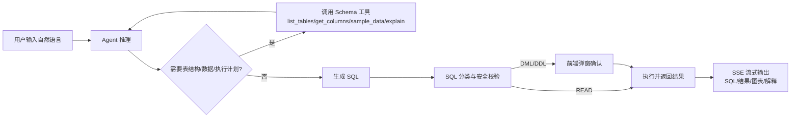
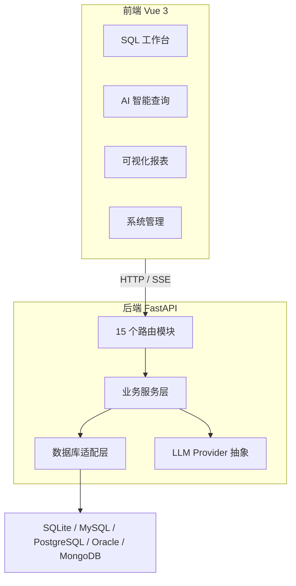

# DataMind 数据库 Agent Web 应用 —— 竞赛展示 PPT 生成大纲

> 用途：作为 AI 生成 PPT（如 Gamma / 讯飞智文 / WPS AI / ChatGPT 生成幻灯片 / Marp / Slidev）的 Markdown 源文档。
> 建议页数：14 页；路演时长：8–10 分钟。
> 建议风格：深蓝科技风 / 白底浅蓝商务风，主色 `#0B5FFF`、辅助色 `#22C55E`、警示色 `#EF4444`，避免花哨动画，突出产品截图和流程图。

---

## PPT 元数据

- 标题：DataMind —— 数据库 Agent Web 应用
- 副标题：自然语言驱动的一体化数据库查询与运维工作台
- 版本：v2.0.0
- 团队/演示人：待填写
- 竞赛主题：AI 编程 / 智能软件创新 / 数据库工具
- 核心卖点：AI Agent 自然语言查询、跨数据库适配、SQL 安全执行、可视化报表、RBAC + 审计
- 演示账号：`admin / admin123`
- 演示入口：开发模式 `http://127.0.0.1:5174`，生产/Docker 模式 `http://127.0.0.1:8000`

---

## 第 1 页 · 封面

**页面类型**：封面

**核心文案**：

- 主标题：DataMind
- 副标题：数据库 Agent Web 应用
- 一句话定位：用自然语言，管理你的数据库
- 底部信息：项目版本 v2.0.0、演示人、竞赛名称、日期

**建议视觉**：

- 深色背景 + 渐变光斑。
- 中央放项目名称，右侧或下方放数据库/代码/AI 图标组合。
- 留出 3 个关键词徽章：`AI Agent`、`Multi-Database`、`Security First`。

**演讲备注**：

- 开场不超过 15 秒：这是一个“前后端分离 + AI Agent 驱动”的数据库查询与运维工作台。
- 用一句话说清楚用户价值：不会 SQL 的人也能查询，会 SQL 的人更快。

---

## 第 2 页 · 项目概述与产品定位

**页面类型**：概述页

**核心文案**：

- 产品定位：开源、智能、跨数据库的 Agent Web 应用。
- 用户既可通过自然语言查询，也可使用传统 SQL 编辑器完成查询、表结构管理、性能分析和报表导出。
- 目标用户：后端开发者、DBA、数据分析师、非技术产品/业务人员。

| 用户 | 核心需求 | 典型场景 |
| --- | --- | --- |
| 后端开发者 | 快速查数、写/优化 SQL、看表结构 | 日常开发、数据排障 |
| DBA | 多实例管理、结构变更监控、文档导出 | 运维、变更审计 |
| 数据分析师 | 自然语言取数、生成可视化报表 | 数据探索、报表制作 |
| 产品经理 | 不熟悉 SQL，但需要看数据 | 辅助决策、简单分析 |

**建议视觉**：

- 左文右图：左侧定位与价值，右侧用四象限或用户卡片。
- 关键词放大：`AI 驱动`、`多数据库统一`、`高效工作台`、`轻量可扩展`。

**演讲备注**：

- 强调“不只是一个 SQL 编辑器”，而是从连接到查询、分析、报表、审计的完整闭环。
- 明确与常见数据库客户端（Navicat/DBeaver）的差异：内置 AI Agent、Web 化协作、权限与审计。

---

## 第 3 页 · 痛点与解决思路

**页面类型**：问题—方案对照页

**核心文案**：

- 痛点 1：业务人员不会写 SQL，取数依赖技术同事。
- 痛点 2：数据库类型多，工具切换成本高。
- 痛点 3：AI 生成 SQL 存在风险，写操作缺少安全控制。
- 痛点 4：查询结果难以沉淀为报表和文档，协作效率低。
- 痛点 5：敏感数据、用户操作缺少统一权限和审计。

**解决思路**：

- `自然语言 → SQL → 执行 → 可视化`，降低使用门槛。
- `BaseDBAdapter + registry` 统一接入 SQLite/MySQL/PostgreSQL/Oracle/MongoDB 等。
- `READ 自动执行 / DML 手动确认 / DDL 高危确认`，安全兜底。
- 报表、仪表盘、大屏、文档导出复用同一套查询结果。
- 5 个内置角色 + 自定义角色 + 全量审计日志。

**建议视觉**：

- 左侧红色/灰色痛点列表，右侧蓝色方案列表，用箭头连接。

**演讲备注**：

- 用一句“真实工作流”举例：产品经理打开网页，输入“本月新增用户按日分组”，系统自动生成 SQL 并返回结果，再一键生成图表。

---

## 第 4 页 · 功能全景

**页面类型**：功能地图

**核心文案**：

- 连接管理：数据源 CRUD、连接测试、SSH 隧道、多环境标签、密码加密。
- SQL 工作台：多 Tab 编辑器、CodeMirror 6、对象树、执行历史、结果分页/排序/导出、结果集直接编辑。
- 元数据管理：Schema/表/列/索引/DDL/视图/函数/存储过程/触发器/序列。
- AI Agent：NL→SQL、SQL 解释/优化、多轮会话、工具调用、写操作授权、失败自动修正。
- 文档导出：CSV/JSON/Excel；库文档异步导出 Word/Markdown/HTML。
- 可视化报表：图表 CRUD、仪表盘、分享链接、大屏模式。
- 系统管理：大模型配置、偏好设置、用户/角色权限、审计日志、定时导出。
- 运维监控：连接概览、慢查询、表结构对比、Prometheus 指标。

**建议视觉**：

- 使用“中心圆 + 八模块环绕”结构，或上下两排 4×2 卡片。
- 核心模块 `AI Agent` 用高亮色。

**演讲备注**：

- 不逐条念功能，只强调“功能不是堆砌，而是围绕查询—分析—报表—管理闭环组织”。
- 可补充：定时导出、审计保留期自动清理等工程化细节。

---

## 第 5 页 · 核心亮点一：AI Agent 全流程

**页面类型**：流程页

**核心文案**：

- 用户输入自然语言，Agent 自动生成 SQL。
- SSE 流式输出：`session_title / thought / tool / retry / sql / result / text / chart / authorization_required / done / error`。
- 四个内置工具：`list_tables`、`get_columns`、`sample_data`、`explain`，最多 3 轮工具调用。
- READ 查询失败后，自动让 LLM 修正并重试，最多 3 次。
- 历史成功 SQL 作为 few-shot 注入，持续提升准确率。
- 多模型统一抽象：OpenAI 兼容、Claude、Ollama。

**流程**：

**建议视觉**：

- 横向流程图，AI 循环部分用虚线框。
- 右侧放一个“输入问题 → 输出图表”的截图占位。

**演讲备注**：

- 重点讲“工具调用 + 失败重试 + few-shot”，这是 AI 编程竞赛最看重的工程深度。
- 可以现场演示：输入“查询本月新增用户数并按日分组”，展示思考过程、SQL、结果和图表生成。

---

## 第 6 页 · 核心亮点二：SQL 安全执行协议

**页面类型**：机制说明页

**核心文案**：

| 操作类型 | 授权方式 | 说明 |
| --- | --- | --- |
| SELECT / SHOW / DESC / EXPLAIN | 自动执行 | 只读查询直接返回 |
| INSERT / UPDATE / DELETE | 手动确认 | 返回影响预览与 execution_id |
| CREATE / ALTER / DROP / TRUNCATE | 高危确认 | 红色警告，展示完整 DDL |
| 多条混合 SQL | 逐条确认 | 按 SQL 类型分别处理 |

- `execution_id` 暂存待确认执行，5 分钟过期。
- 用户确认后再次鉴权，防止绕过或过期执行。
- 所有 SQL 执行记录审计：操作类型、SQL 文本、状态（approved/rejected）。

**建议视觉**：

- 三层“绿灯 / 黄灯 / 红灯”卡片。
- 配一张 `ConfirmExecModal.vue` 弹窗截图。

**演讲备注**：

- 这是项目的信任基础：让 AI 能生成 SQL，但不让 AI 拥有不受控的写权限。
- 可对比“直接给 AI 数据库权限”的传统做法，突出安全设计。

---

## 第 7 页 · 系统架构

**页面类型**：架构图

**核心文案**：

- 前端：Vue 3 + TypeScript + Vite + Pinia + Naive UI + CodeMirror 6 + ECharts + gridstack。
- 后端：Python 3.12 + FastAPI + SQLAlchemy 2.0（async）+ aiosqlite。
- 分层：`routers → services → adapters → 目标数据库`。
- 应用自身状态存 SQLite（`data/app.db`），演示库为 SQLite。
- LLM Provider 抽象：`OpenAICompatProvider`、`ClaudeProvider`，统一 chat/stream/ping。
- 部署：Docker 多阶段构建，单端口 8000，FastAPI 托管 `frontend/dist`。

**建议视觉**：

**演讲备注**：

- 强调“适配器模式”和“Provider 抽象”两个可扩展点。
- 可提一句：OceanBase、GoldenDB 复用 MySQLAdapter，后续新增数据库成本低。

---

## 第 8 页 · 跨数据库适配层

**页面类型**：技术亮点页

**核心文案**：

- `BaseDBAdapter` 定义统一接口：connect / test / metadata / execute / explain / schema_summary。
- 已支持：SQLite、MySQL、PostgreSQL、Oracle、MongoDB；OceanBase、GoldenDB 复用 MySQLAdapter。
- 函数/存储过程 DDL 已实现：MySQL `SHOW CREATE`、PostgreSQL `pg_get_functiondef/pg_get_triggerdef`、Oracle `dbms_metadata`。
- 序列支持：SQLite/MySQL/Oracle/PostgreSQL；MongoDB 不适用。
- 连接参数统一由 `ConnectionInfo` 承载，包含 SSH 隧道。

**建议视觉**：

- 左侧放 `BaseDBAdapter` 抽象接口，右侧列出数据库品牌卡片。
- 用同一颜色标识“复用 MySQLAdapter”的 OceanBase/GoldenDB。

**演讲备注**：

- 重点讲“同一套 Agent 工具如何屏蔽数据库方言差异”。
- 可举例子：获取表结构在不同数据库里调用不同 SQL，但上层服务无感知。

---

## 第 9 页 · 权限、安全与审计

**页面类型**：安全保障页

**核心文案**：

- 认证：Cookie 会话，httponly `session_token`，24 小时 TTL。
- 密码哈希：pbkdf2；敏感字段：Fernet 加密，接口只返回 `has_password/has_key` 布尔值。
- RBAC：用户 → 角色 → permissions（JSON），5 个内置角色 + 自定义角色。
- SQL 权限细分：READ 需 `workspace`，DML 需 `sql_write`，DDL 需 `sql_ddl`。
- 审计：登录、SQL 执行、Agent 动作全量记录，可导出 CSV/XLSX。
- 保留期：`audit_retention_days` 默认 180 天，启动时自动清理。

**建议视觉**：

- 使用“身份认证 → 权限校验 → 数据加密 → 审计追踪”四段式。
- 配一张 `UsersView.vue` 或 `RolesView.vue` 截图。

**演讲备注**：

- 强调“企业级安全不是口号”：每个敏感字段都有加密，每个危险操作都有确认和审计。
- 与竞赛评分点“安全性 / 完整性”直接对应。

---

## 第 10 页 · 运维监控与工程化

**页面类型**：工程能力页

**核心文案**：

- 运维监控：连接概览、慢查询统计、表结构对比（schema diff）。
- 定时导出：每分钟扫描到期任务，复用 `export_service` 导出并记录 `last_status/last_file`。
- 可观测性：`/metrics` 暴露 Prometheus 指标（REQUEST_COUNT / REQUEST_LATENCY / SQL_EXECUTIONS）。
- 测试：21 个后端测试文件，约 115 个 pytest 用例；前端 Vue TS 构建校验；Playwright E2E 脚本。
- 部署：Dockerfile 多阶段构建 + docker-compose，数据卷 `dbagent-data` 持久化。

**建议视觉**：

- 左列“监控项”，右列“测试/部署”指标卡。
- 放一个 `/metrics` 或 `MonitorView.vue` 截图占位。

**演讲备注**：

- 工程化能力是竞赛加分项，但不要展开太深，用数据和截图快速证明。
- 可用数字：后端约 43 个 Python 文件 / 5600+ 行，前端约 32 个源文件 / 6400+ 行，95 个 API 端点。

---

## 第 11 页 · 产品界面演示

**页面类型**：截图/演示页

**核心文案**：

- 登录页：`admin / admin123`。
- AI 智能查询：`SmartQueryView.vue` + `AgentPanel.vue`。
- SQL 工作台：`WorkspaceView.vue` + `SqlEditor.vue` + `ObjectTree.vue` + `ResultTable.vue`。
- 可视化报表：`ReportsView.vue` + `ChartCard.vue` + `DashboardGrid.vue` + `BigScreenDashboard.vue`。
- 系统管理：`SettingsView.vue`、`UsersView.vue`、`RolesView.vue`、`AuditView.vue`、`MonitorView.vue`。

**建议视觉**：

- 4 宫格产品截图：智能查询、SQL 工作台、报表、监控。
- 每张截图下方一行说明。

**演讲备注**：

- 现场按“智能查询 → 结果转图表 → 保存报表 → 审计日志”顺序演示。
- 如果时间有限，优先演示 AI Agent 和写操作确认弹窗。

---

## 第 12 页 · 创新点与技术难点

**页面类型**：亮点总结页

**核心文案**：

- 创新点：
  - 自然语言到 SQL 的 Agent 闭环，含工具调用、失败重试、few-shot 增强。
  - 写操作分级确认，让 AI 可用且可控。
  - 跨数据库适配层，统一多源元数据与查询体验。
  - 查询结果一键转图表、仪表盘、分享大屏。
  - RBAC + 全量审计 + Prometheus 指标，具备企业级完整性。
- 技术难点：
  - 多数据库方言抽象与 DDL 提取。
  - Agent 工具调用次数与 token 成本控制（`MAX_TOOL_ROUNDS=3`）。
  - SSE 流式事件在前端的逐步渲染。
  - 结果集直接编辑与写操作确认链路。
  - SSH 隧道连接与敏感信息加密。

**建议视觉**：

- 左右分栏：创新点 / 技术难点。
- 每个点用图标 + 短句，避免大段文字。

**演讲备注**：

- 挑 2–3 个最有差异化的点展开，例如“失败自动修正重试”和“写操作确认协议”。
- 表明团队不是简单调用大模型，而是做了可靠的工程封装。

---

## 第 13 页 · 项目成果与数据指标

**页面类型**：成果页

**核心文案**：

- 版本：v2.0.0。
- 功能模块：14 个功能模块，15 个后端路由文件，约 95 个 API 端点。
- 技术栈：前后端分离，Python 3.12 + FastAPI + Vue 3 + TypeScript。
- 数据支持：SQLite / MySQL / PostgreSQL / Oracle / OceanBase / GoldenDB / MongoDB。
- 测试：约 115 个后端测试用例 + 前端构建校验 + Playwright E2E。
- 部署：Docker 单端口一键启动，数据持久化。

**建议视觉**：

- 大数字卡片：`7` 数据库类型、`95+` API、`115+` 测试、`1` 命令部署。
- 底部一行简短总结。

**演讲备注**：

- 数据只讲 4 个最关键的，不要让观众读表。
- 强调“可运行、可测试、可部署”，比单纯功能列表更有说服力。

---

## 第 14 页 · 总结与展望

**页面类型**：收尾页

**核心文案**：

- 一句话总结：DataMind 用 AI Agent 重新定义数据库查询与数据协作体验。
- 已完成：NL→SQL、安全执行、跨库适配、报表、权限审计、监控、定时导出、Docker 部署。
- 后续规划：
  - 更多数据库适配器与更完整的 DDL/序列支持。
  - 更丰富的 Agent 工具，如索引建议、慢查询根因分析。
  - 图表高级能力、协作工作区、消息订阅通知。
  - 会话级 Prompt 模板与模型评测体系。

**建议视觉**：

- 上半部分总结金句，下半部分 roadmap 箭头图。
- 结束页附二维码或演示入口。

**演讲备注**：

- 最后回到用户价值：让每个人都能安全、高效地与数据对话。
- 预留 Q&A：准备 3 个常见问题——数据安全、AI 准确率、与现有数据库工具差异。

---

## 附录 · 可用于 PPT 的素材清单

- 产品截图：登录页、AI 智能查询、SQL 工作台、结果集编辑、写操作确认弹窗、报表/大屏、审计/监控。
- 流程图：AI Agent 全流程、SQL 安全执行协议、系统分层架构。
- 架构图源文件：`backend/app/adapters/registry.py`、`backend/app/services/agent_service.py`、`backend/app/services/sql_service.py`。
- 关键页面源码：`frontend/src/views/SmartQueryView.vue`、`WorkspaceView.vue`、`ReportsView.vue`、`MonitorView.vue`。
- 演示账号：`admin / admin123`。
- 演示数据：内置 SQLite 演示库，包含 `users / products / categories / orders / order_logs`。

---

## 附录 · 8 分钟演示脚本

1. 00:00–00:15：打开登录页，说明产品定位。
2. 00:15–00:45：进入 AI 智能查询，输入“本月订单金额按日统计”，展示思考过程、SQL、结果、图表。
3. 00:45–01:15：切到 SQL 工作台，展示多 Tab、对象树、执行历史、结果集导出。
4. 01:15–01:45：演示写操作确认：执行一条 DML，展示弹窗、审批、审计日志。
5. 01:45–02:15：展示报表仪表盘和大屏模式。
6. 02:15–02:45：切到系统管理，展示角色权限、用户、审计、监控指标。
7. 02:45–03:00：回到总结页，给出后续规划。

> 说明：以上时间适合 3 分钟快速演示；若路演为 8–10 分钟，可将 AI Agent、安全协议、架构设计各扩展 1–2 页。

---

## 生成 PPT 时的排版建议

- 每页标题统一使用“中文短句 + 英文小标签”，例如“核心亮点 · AI Agent”。
- 避免在单页放超过 6 个要点；优先用卡片、表格、流程图。
- 代码路径用等宽字体，例如 `backend/app/services/agent_service.py`。
- 截图占位处先放灰底边框 + 文字标签，正式生成前替换为真实截图。
- 颜色体系：主色 `#0B5FFF`，成功 `#22C55E`，警告 `#F59E0B`，危险 `#EF4444`，背景使用深蓝或极浅灰。
